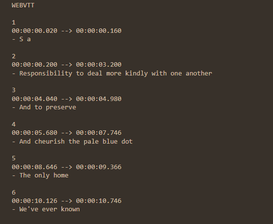

How to use the code:
1. Download the .ipynb file and then upload it on https://colab.research.google.com/.
2. The script can be run by pressing runtime --> run all at the top (or by running the indivual cells 1 by 1 through their run button).
3. Doing this will predict captions for the example audio of this repository (a short segment of the pale blue dot speech by Carl Sagan). As shown here:

You can generate captions for other audio files by changing the --Input path and using other languages by changing the --Language.
Currently supported languages:
EN, RU, PT, FR, NL, ES, DE, PL, IT, JP, FN, GR

(Repo is operational, but still being worked on 27-10-2022)
